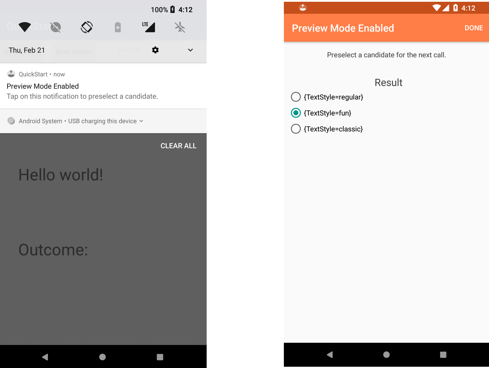

# Amp-Android
<sup>by Scaled Inference</sup>

<br>
Android Client for Amp.ai.

## Amp.ai
Amp.ai is a cloud AI platform that can enhance any software application that integrates with it by making intelligent, goal-driven, context-sensitive decisions. Think of it as A/B testing on steroids. While A/B testing provides information about what choice to take across all users, Amp.ai will provide you with a decision that is specific to a context and will continue to improve and provide your users with the best decision based on the context they are in.

## Compatibility
The Amp framework supports Android API level 14 and above and requires compatibility with Java 7.

## Getting Started
1. Install Java 7
2. [AndroidStudio](https://developer.android.com/studio/install.html)

## Gradle

### Add it in your root build.gradle at the end of repositories
``` Gradle
allprojects {
    repositories {
        ...
        maven { url 'https://jitpack.io' }
    }
}
```

### Add the dependency
``` Gradle
dependencies {
    compile 'com.github.ScaledInference:amp-android:1.1.6'
}
```

### Add permission to AndroidManifest.xml
``` AndroidManifest
<uses-permission android:name="android.permission.INTERNET" />
```

## Amp

### Initialization
To use amp, import the Amp framework and create an amp instance with this class. The Amp instance should be created at the application startup to handle session lifecycle properly. Here is an example of initializing Amp in your `Application`:

``` Java
import amp.core.Amp;

public class MyApplication extends Application {
    private Amp mAmp;

    @Override
    public void onCreate() {
        super.onCreate();

        mAmp = new Amp(this, "<projectKey>");
    }

    public Amp getAmp() {
        return mAmp;
    }
}
```
In your AndroidManifest.xml:
``` Manifest
<application android:name="com.yourapp.MyApplication"/>
```
These lines initialize the amp and session instances that represent a single session in the Amp project corresponding to the `projectKey` that will be given to you. How to define a user session is completely up to you. Please see [this section](#session) for detailed information.

### Context
Observe the context by sending events to Amp.ai. Events in a session that precede a decision point form the "context" for that decision. Amp automatically discovers relevant contexts for decisions as the data evolves, and does so continuously. You have the option of sending additional context by explicitly using the 'observe' API call. For example, a business-specific context could be a Customer context, with a property, "type", and a value of "Free" or "Premium".

``` Java
Map<String, Object> properties = new HashMap<>();
properties.put("type", "Premium");
amp.observe("Customer", properties);
```

### Decide
Leverage the power of Amp.ai by invoking the `decide` API call. The call consists of decision candidates that are presented to Amp. The first candidate in the list is treated by Amp as the `default`, and this decision would be used in the baseline group. Amp will pick the decision that results in maximizing the probability of improving your business metrics. For example, users in Japan using the Chrome browser may prefer to purchase ice-cream instead of chocolate. Amp would learn this behavior as it observes that this user segment typically chooses this action and results in improved sales.

``` Java
List<Object> choiceOptions = Arrays.asList("Chocolate", "Ice Cream", "Cookies");
Map<String, List<Object>> candidates = new HashMap<>();
candidates.put("choice", choiceOptions);

Map<String, Object> decision = amp.decide("Snack", candidates);
```

### Outcome
The outcome is simply the business metric you are optimizing for. Amp can optimize multiple metrics simultaneously. Once the metric has been defined, Amp.ai is informed of the outcome by an `observe` call.

``` Java
amp.observe("Sale", new HashMap<>());
```

## Advanced settings

### LoadRules
Use this when you need to ensure that decisions made through `Amp#decide()` are made based on the rules provided by the server. A common use case is when a one-time decision must be made on start of the application. If the rules are already available, the callback will be called immediately from this method. If the rules are not ready, it will wait for the sync to complete and callback will be executed.


``` Java
// Show a dialog when operation is performed on the background thread
dialog.show();

amp.loadRules(timeout, new CoreAmp.CompletionListener() {
    @Override
    public void onCompleted(Throwable throwable) {
        // The callback is executed on the main thread, so it's safe to change the UI
        dialog.dismiss();

        // Chose a tab that will suite current customer
        Map<String, Object> decision = amp.decide(KEY_TAB, getTabCandidates());
        ....
    }
});
```

### Session

The default behavior is to end the session after inactivity period (the app in background state and no events were fired) becomes more than `sessionTTL`, or time interval since session creation is more than `sessionLifetime`.
`sessionTTL`, `sessionLifetime` could be set up during amp initialization. You could also explicitly finish the current session and and start a new one using the following method:

``` Java
amp.startNewSession();
```

### Builtin Events
By default, when using the amp-android client, we will observe general session information on the `AmpSession` event.

### Configuration Options
The following options are available. 

|Name|Default Value|Data Type|Details|
|----|:-----------:|:-------:|-------|
|debug|false|Boolean|true, false|
|builtinEvents|All amp built-in events|List|Events that are created upon initialization|
|sessionTTL|15 minutes|Long|Session time to live in milliseconds|
|sessionLifetime|24 hours|Long|Session lifetime in milliseconds|

### Preview mode

When it’s time to test the variants of the decision call, the preview mode will help to do just that. When enabled, it will allow preselecting the result of the next decide call. Note: don’t use it in the release version, as it’s only for testing.

To turn on the preview mode, enable it in the Amp config:

```
Config config = new Config.Builder()
       .setPreviewOn(true)
       .build();
Amp amp = new Amp(this, PROJECT_KEY, config);
``` 

Here is how it will look:



## Usage
There are many ways in which you will want to use Amp.  You may want to track how often each Activity is typically visited in your application or how far down a scrollable view your user scrolls.  If your application requires sign up and registration, you may want to track the occurrence of taps on the sign up button because you may want to increase your user's sign up rate using Amp.  The possibilities are endless, and with Amp, not only will it track whatever you ask of it, it will also check the context in which these events occurred.  With this information, Amp will make the best decisions to improve upon whatever business goals you have.
Below are just a few examples on how you might make `observe` and `decide` requests in your application.

### Observe Usages
#### I want to track the activites that are visited
This is one use of the Android lifecycle methods, `onCreate`.

``` Java
protected void onCreate(Bundle savedInstanceState) {
    super.onCreate(savedInstanceState);
    Map<String, Object> properties = new HashMap<>();
    properties.put("name", "<name of the activity>");
    amp.observe("AmpActivity", properties);
}
```
#### I want to track button taps
``` Java
Button clickButton = findViewById(R.id.button);
clickButton.setOnClickListener(new View.OnClickListener() {
    @Override
    public void onClick(View v) {
        String buttonText = ((Button)v).getText().toString();
        Map<String, Object> properties = new HashMap<>();
        properties.put("value", buttonText);
        amp.observe("ButtonClick", properties);
    }
});
```

#### I want to track what people are searching for
Use a listener method to help you here.

``` Java
SearchView searchView = findViewById(R.id.search);
searchView.setOnQueryTextListener(new SearchView.OnQueryTextListener() {
    @Override
    public boolean onQueryTextSubmit(String query) {
        Map<String, Object> properties  = new HashMap<>();
        properties.put("value", query);
        amp.observe("Search", properties);
        return true;
    }
    ...
});
```


### Decide Usages

#### I want to select tab using amp

``` Java
// Choose a tab that will suit current customer
Map<String, Object> decision = amp.decide(KEY_TAB, getTabCandidates());
String selectedTab = (String) decision.get(KEY_TAB);

// Update the UI
if (FIRST_TAB.equals(selectedTab)) {
    mNavigation.setSelectedItemId(R.id.first_tab);
} else if (SECOND_TAB.equals(selectedTab)) {
    mNavigation.setSelectedItemId(R.id.second_tab);
}
```

ProGuard
--------
If you are using ProGuard you need to add the following options:
```

## Gson
-keepclassmembers enum amp.core.** { *; }

-keepattributes Signature
-keepattributes *Annotation*
-dontwarn sun.misc.**
-keep class com.google.gson.examples.android.model.** { *; }
-keep class * implements com.google.gson.TypeAdapterFactory
-keep class * implements com.google.gson.JsonSerializer
-keep class * implements com.google.gson.JsonDeserializer

# OkHttp
-dontwarn okhttp3.**
-dontwarn okio.**
-dontwarn javax.annotation.**
-dontwarn org.conscrypt.**
-keepnames class okhttp3.internal.publicsuffix.PublicSuffixDatabase

# Retrofit
-keepattributes Signature
-keepclassmembernames,allowobfuscation interface * {
    @retrofit2.http.* <methods>;
}
-dontwarn org.codehaus.mojo.animal_sniffer.IgnoreJRERequirement

# Serializable
-keepnames class * implements java.io.Serializable
-keepclassmembers class * implements java.io.Serializable { 
    static final long serialVersionUID; 
    private static final java.io.ObjectStreamField[] serialPersistentFields; 
    !static !transient <fields>; 
    private void writeObject(java.io.ObjectOutputStream); 
    private void readObject(java.io.ObjectInputStream); 
    java.lang.Object writeReplace(); 
    java.lang.Object readResolve(); 
}
```
Or you can check for the most recent versions of ProGuard config for [OkHttp][1] and [Retrofit][2].
More details about using Proguard with Serializable [here][3].


 [1]: https://github.com/square/okhttp#proguard
 [2]: https://github.com/square/retrofit#proguard
 [3]: https://www.guardsquare.com/en/proguard/manual/examples#serializable